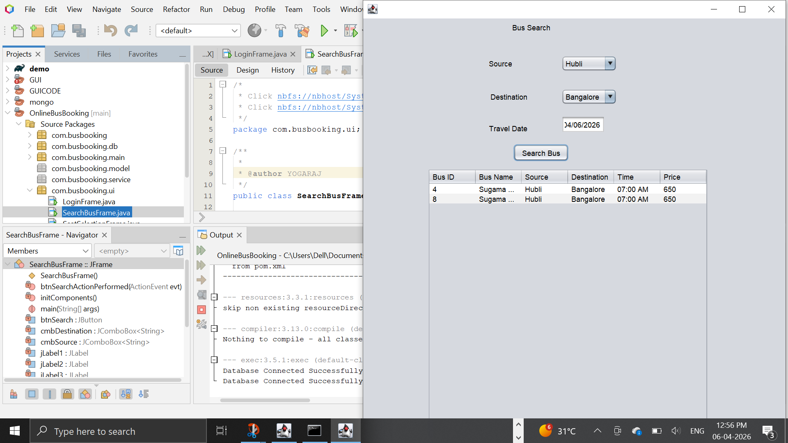
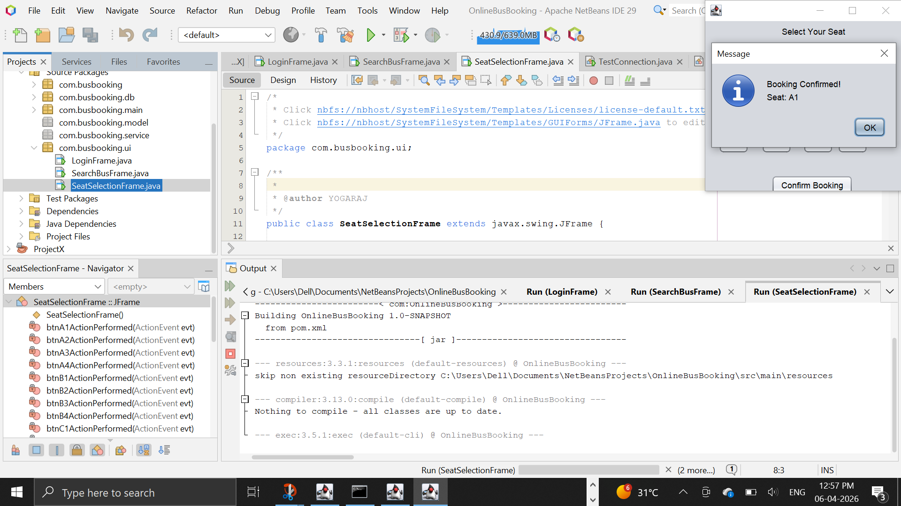

# Online Bus Booking System

##  Description
A Java Swing Desktop Application for booking bus tickets with seat selection and search functionality.

##  Technologies Used
- Java
- Swing (GUI)
- JDBC
- MySQL
- Maven

##  Features
- User Login
- Search Buses
- Seat Selection
- Database Connectivity

  ##  Screenshots

##  Project Structure
- com.busbooking.ui → UI screens
- com.busbooking.db → Database connection
- com.busbooking.main → Entry point

##  How to Run
1. Open project in NetBeans
2. Configure database in DBConnection.java
3. Run the application

##  Author
Yogaraj C
